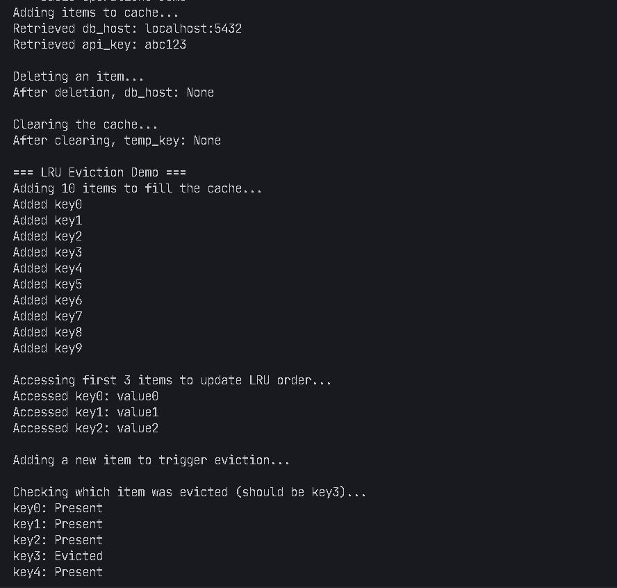
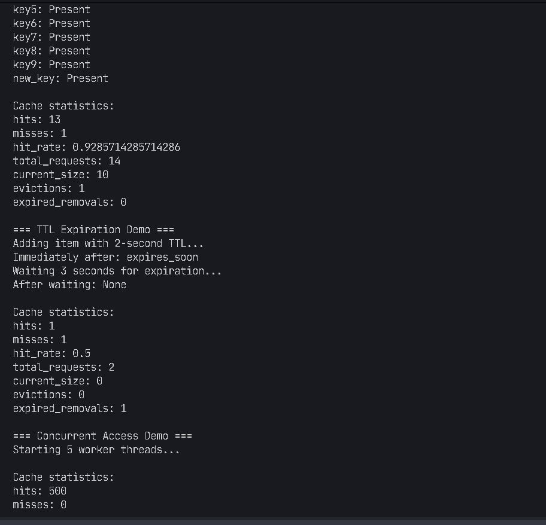
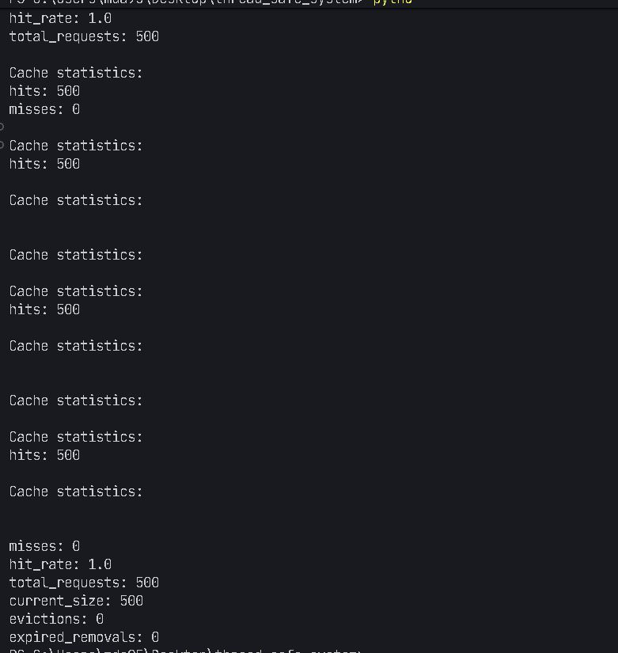

# Thread-Safe In-Memory Cache System

This project implements a thread-safe in-memory cache system with support for concurrent operations, automatic expiration of entries, memory size limits, and performance tracking features.

## Features

- **Thread-safe operations**: Supports concurrent access from multiple threads
- **LRU (Least Recently Used) eviction**: Automatically removes least recently used items when the cache is full
- **TTL (Time-To-Live) support**: Entries can expire after a specified time
- **Background cleanup**: Periodically removes expired entries
- **Performance statistics**: Tracks hits, misses, evictions, and more
## Console..



## Dependencies

This project uses only Python standard libraries:

- `threading`: For thread safety and background cleanup
- `time`: For TTL management
- `typing`: For type hints
- `unittest`: For testing

Python 3.6+ is required due to the use of type hints.

## How to Run the Code

### Installation

No installation is required beyond having Python 3.6+.

### Running the Demo

```bash
python demo.py
```

This will run a demonstration of the cache's features, including basic operations, eviction, expiration, and concurrent access.

### Running the Tests

```bash
python -m unittest test_cache.py
```

This will run the test suite to verify the functionality of the cache.

## Design Decisions

### Core Data Structures

1. **HashMap/Dictionary**: Used for O(1) key-value lookups
2. **Doubly Linked List**: Maintains LRU order with O(1) operations for moving nodes
3. **CacheNode**: Encapsulates key, value, expiry time, and linked list pointers

### Concurrency Model

The cache uses a reentrant lock (`threading.RLock`) to ensure thread safety. This allows:

- Multiple threads to safely perform operations on the cache
- The same thread to acquire the lock multiple times (useful for recursive operations)
- Atomic operations for complex procedures like eviction and cleanup

The lock is acquired for all public methods to ensure consistent state during operations. This approach provides strong consistency guarantees but may lead to contention under high load.

### Eviction Logic

The LRU (Least Recently Used) eviction strategy is implemented using a doubly linked list:

1. New or accessed items are moved to the front of the list (most recently used)
2. When the cache reaches its capacity, the item at the end of the list (least recently used) is evicted
3. All operations (add, remove, move) on the linked list are O(1)

### TTL Management

1. Each entry has an optional expiration timestamp
2. Expired entries are detected and removed during:
   - Access operations (get)
   - Periodic background cleanup
3. A background thread runs at configurable intervals to remove expired entries

## Sample Stats Output

The cache provides detailed statistics through the `get_stats()` method:

```python
{
    "hits": 150,              # Number of successful cache retrievals
    "misses": 25,            # Number of failed cache retrievals
    "hit_rate": 0.857,       # Ratio of hits to total requests
    "total_requests": 175,   # Total number of get operations
    "current_size": 45,      # Current number of items in the cache
    "evictions": 12,         # Number of items removed due to size constraints
    "expired_removals": 8    # Number of items removed due to expiration
}
```

## Performance Considerations

### Strengths

1. **O(1) Operations**: All core operations (get, put, delete) have O(1) time complexity
2. **Memory Efficiency**: The cache automatically manages memory usage through eviction
3. **Configurable TTL**: Flexible expiration policies at both cache and entry level

### Potential Bottlenecks

1. **Lock Contention**: Under high concurrency, the global lock may become a bottleneck
2. **Cleanup Overhead**: The background cleanup thread may impact performance for large caches

### Possible Improvements

1. **Fine-grained Locking**: Implement sharding or segment-level locks to reduce contention
2. **Lazy Cleanup**: Use probabilistic cleanup instead of periodic full scans
3. **Configurable Eviction Policies**: Support additional policies beyond LRU (e.g., LFU, FIFO)
4. **Memory-aware Eviction**: Consider item size in eviction decisions

## Error Handling

The cache handles several error conditions:

1. **Invalid Keys**: Raises ValueError for None or empty keys
2. **Expired Access**: Returns None for expired entries
3. **Concurrency Issues**: Uses locks to prevent race conditions

## License

This project is available under the MIT License.
